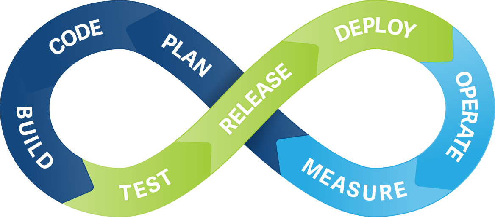

# Designing Cloud Native Applications

by *Adrian Moreno Martinez*

---

## Pets vs Cattle


----

## Pets

- They are given names like Max, Rocky, Molly
- They are unique and lovely
- You care about them
- When they get ill, we heal them

----

## Cattle

- They are given names like vm0024, vm0183, ...
- They are almost identical to other cattle
- When they get ill, we get another one

----

<!-- .slide: data-background="img/pets_vs_cattle.png" data-background-size="85%" -->

---

## Industries are being disrupted

----

## Transportation

<br>


----

## Entertainment

<br>


----

## Travel and hospitality

<br>


----

## Financial services

<br>


----

## Automotive


----

## What do these companies have in common?

----

## They have adopted the Cloud way

- Speed of innovation
- Always-available services
- Web scale
- Mobile-centric user experiences
- Feature-rich metrics, monitoring, alerting, and data visualization frameworks

---

## How do we move to the Cloud way?

<br>

### 3 parts:
1. **People**
2. **Processes**
3. **Technology**

----


----



----

<!-- .slide: data-background="img/tools.jpg" data-background-size="80%" -->

<!--  -->

---

## 12 factors

- Best practices for building modern scalable web apps
- http://12factor.net
- Written by Heroku engineers in 2012

----


If you are using **Docker** in production, you probably **already** have a 12-Factor app!
<br>


----

I wish I had known this before I started with Docker...
<br>


----

## The factors

<table>
  <tr>
    <td>**I.** Codebase</td>
    <td>**VII.** Port binding</td>
  </tr>
  <tr>
    <td>**II.** Dependencies</td>
    <td>**VIII.** Concurrency</td>
  </tr>
  <tr>
    <td>**III.** Config</td>
    <td>**IX.** Disposability</td>
  </tr>
  <tr>
    <td>**IV.** Backing services</td>
    <td>**X.** Dev/prod parity</td>
  </tr>
  <tr>
    <td>**V.** Build, release, run</td>
    <td>**XI.** Logs</td>
  </tr>
  <tr>
    <td>**VI.** Processes</td>
    <td>**XII.** Admin processes</td>
  </tr>
</table>

----

## **I.** Codebase

> One codebase tracked in revision control, many deploys


----

## **II.** Dependencies

> Explicitly declare and isolate dependencies.

<br>

1. Declare **dependencies** in a **manifest**
2. Use **isolation** tools
3. **Specific** versions are important

----

## **II.** Dependencies

**Dependency manifest**
- `Gemfile` in Ruby
- `requirements.txt` in Python

**Isolation tools**
- `bundle exec` in Ruby
- `virtualenv` in Python

**Versions**
- `gem "redis-rails", "~> 3.2.3"` (Gemfile)
- `django-redis==4.4.3` (requirements.txt)


----

## **III.** Config

> Store config in the environment

<br>

- Config is the **specific** information required to host a deployment of your codebase.
- Mainly database **credentials**, **paths**, **resource URLs**, etc.
- Keep your config **outside** the app
- No config in git - Open Source test

----

## **III.** Config

<br>

##### Use **environment variables**

```
production:
  adapter: mysql2
  database: <%= ENV['DB_ENV_MYSQL_DATABASE'] %>
  username: <%= ENV['DB_ENV_MYSQL_USER'] %>
  password: <%= ENV['DB_ENV_MYSQL_PASS'] %>
  port: <%= ENV['DB_PORT'] %>
  host: <%= ENV['DB_HOST'] %>
```

----

## **IV.** Backing services

> Treat backing services as attached resources

<br>

- e.g. datastore, mail service, cache, message broker
- Allows changing of service without code changes
- Makes no distinction between **local** and **third-party** services

----

## **IV.** Backing services


----

## **V.** Build, release, run

> Strictly separate build and run stages

<br>

* `BUILD` = codebase + dependencies + assets
* `RELEASE` = `BUILD` + config
* `RUN` (runtime) = run process against `RELEASE`

----

## **V.** Build, release, run


----

## **V.** Build, release, run
<br>

- **Cannot change** at **runtime**
- **Rollback** = just use previous release
- Every release has a unique **release ID**

----

## **VI.** Processes

> Execute the app as one or more stateless processes

<br>

- Processes are **stateless** and **share nothing**
- e.g. **No sticky sessions** to cache user data
- Use a stateful backing service instead, typically a datastore
- Allows **scaling out**

----

## **VII.** Port binding

> Export services via port binding

<br>

- The **contract** with the **execution environment** is binding to a **port** to serve requests.
- Allows **modularization**
- One app can become the **backing service** for another app

----

## **VIII.** Concurrency

> Scale out via the process model

<br>

- Processes can handle **own multiplexing**
- Small defined apps allows scaling as need to handle load

----

## **VIII.** Concurrency

#### Scale out by running multiple processes of different types


----

## **IX.** Disposability

> Maximize robustness with fast startup and graceful shutdown

<br>

- Processes are **disposable**
- Start **quickly**, shutdown **gracefully**
- Be robust against **sudden death**
- Changes need to take effect quickly

----

## **X.** Dev/prod parity

> Keep development, staging, and production as similar as possible

<br>

- **Shorten the gaps**
- Get developers **involved** in operations
- Continuous deployment requires same environment to **minimize errors**

----

## **XI.** Logs

> Treat logs as event streams

<br>

- Logs are handled **differently** depending on the **environment**
- **Don't** route or store **logs in files**
- Stream to **stdout** instead to be captured by the environment

----

## **XII.** Admin processes

> Run admin/management tasks as one-off processes

<br>

- Database migrations, console, one-time scripts
- e.g. `python manage.py migrate`
- Run as **separate** process
- **Admin code** ships with **app code**

---

## What might this all look like?

----


---


http://goo.gl/qb7R98 &nbsp;&nbsp;&nbsp; http://goo.gl/6skTah

---

# Thank you

## Questions?

<br><br><br>

[adrianmo.github.io/slides/12factor](http://adrianmo.github.io/slides/12factor)
