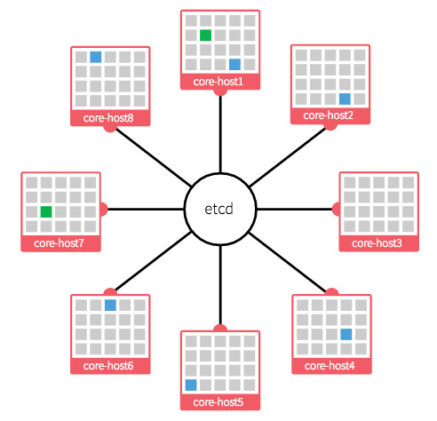
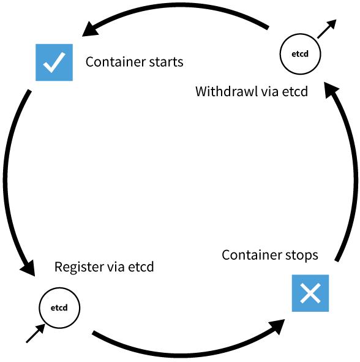

# The new minimalist operating systems

by *Adrian Moreno Martinez*

---

- Designed to host container applications
- Simplify infrastructure

----

## Common features

- Stability is enhanced through transactional upgrade/rollback semantics
- Traditional package managers are absent
- Security is enhanced through isolation mechanisms
- `systemd` provides system/service management

---

# Snappy Ubuntu


----

- Released December 2014
- Originally JeOS, “Just Enough OS”
- AppArmor packaging tool

---

<!-- .slide: data-background="#101013" -->


----

- Released April 2014
- Supported by RedHat
- Fedora, RHEL, and CentOS Atomic releases
- Replaces `yum` with `rpm-ostree`
- SELinux is enabled

---

<!-- .slide: data-background="#333" -->


----

- Released February 2015
- Just 20 MB
- System Docker and User Docker
- Simple Updates and Rollbacks

----

<!-- .slide: data-background="#333" -->


---

<!-- .slide: data-background="#fff" -->


----

- Released April 2015
- Created by VMware
- Integration to vSphere, vCloud, NSX, vSAN...
- Compatible with Docker, rkt, and Pivotal Garden

---


----

- Released August 2013
- Derivative of Chromium OS (and by extension Gentoo)
- Designed to simplify deployment in clustered environments
- Release channels: alpha, beta, and stable
- Cloud-Init support
- Comes with `etcd` and `fleet`

----


- Distributed key value store
- Written in Go
- Raft consensus algorithm
- Key/Value storage with TTL
- Watch for Changes
- Used by `Kubernetes`, `fleet`, `vulcand`, ...

----

<!-- .slide: data-background="#fff" -->



----



----

# Fleet

- `fleet` = `systemd` + `etcd`
- Distributed init system
- Cluster management
- Ensures high availability

----

helloworld.service:
```
[Unit]
Description=Hello World
Requires=docker.service
After=docker.service

[Service]
Restart=on-failure
ExecStartPre=-/usr/bin/docker kill helloworld
ExecStartPre=-/usr/bin/docker rm helloworld
ExecStartPre=/usr/bin/docker pull tutum/hello-world
ExecStart=/usr/bin/docker run --name helloworld \
                              -P \
                              tutum/hello-world
ExecStop=/usr/bin/docker stop helloworld

[X-Fleet]
Global=true
```

Start service:
```
fleetctl start helloworld.service
```

----

<!-- .slide: data-background="images/Fleet-Scheduling.png" data-background-size="80%" -->

----


- Originally designed for `Kubernetes`
- Uses `etcd` to store IP mappings
- One net per cluster; one subnet per machine
- Unique routable IP per container inside the cluster
- Reduces complexity; avoids port mappings

---

<!-- .slide: data-background="images/demo.jpg" data-background-size="70%" -->

---

# FIN

## adrianmo.github.io/slides/containeros
