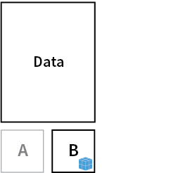
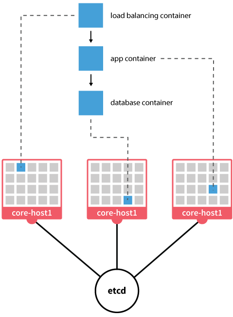

# Container-focused operating systems

by *Adrian Moreno Martinez*

---

## Everything runs on a container

**`Docker`**, `rkt`, `Garden`, ...

----

## Small footprint

tens of MB **VS** hundreds of MB

----

## Atomic upgrade/rollback

----

## No package managers

`apt-get`, `yum`, `dnf`, ...

----

## Tools for cluster management, container announcement, and discovery

---

# Snappy Ubuntu


----

- Released December 2014
- Originally JeOS, “Just Enough OS”
- Transactional updates and rollbacks
- AppArmor kernel security
- Snaps: `apps` and `frameworks`

----

## Frameworks

- Third-party services that provide the runtime and dependencies to applications
- Extend the system and mediate access to shared resources
- `Docker` is the first supported framework

----

## Applications

- Run within the context of frameworks
- Containerized apps are Snaps within a `Docker` framework
- Each Snapp is packaged and deployed in an isolated manner

----

## Snappy architecture


----

# Snappy demo

---

<!-- .slide: data-background="#101013" -->


----

- Released April 2014
- Created by RedHat
- Fedora, RHEL, and CentOS Atomic releases
- Replaces `yum` with `rpm-ostree`
- SELinux is enabled
- Cockpit

---

<!-- .slide: data-background="#333" -->


----

- Released February 2015
- Superminimal OS - just 20 MB
- System Docker (PID 1) and User Docker
- Simple Updates and Rollbacks

----

<!-- .slide: data-background="#333" -->


----

# RANCHER DEMO

---

<!-- .slide: data-background="#fff" -->


----

- Released April 2015
- Created by VMware
- Optimized for vSphere, vCloud, NSX, vSAN...
- Compatible with Docker, rkt, and Pivotal Garden
- Project Lightwave

---


----

- Released August 2013
- Designed to simplify deployment in clustered environments
- Release channels: `alpha`, `beta`, and `stable`
- Dual root partition
- Cloud-Init support
- Comes with `etcd`, `rkt`, `fleet`, `flannel`, ...

----


CoreOS is currently booted off partition A. An update is installed onto partition B

----



Machine is rebooted onto the B partition

----



----


- Distributed key value store
- Written in Go
- Raft consensus algorithm
- Key/Value storage with TTL
- Watch for Changes
- Used by `Kubernetes`, `fleet`, `vulcand`, ...

----

<!-- .slide: data-background="#fff" -->


----


----

# Fleet

- `fleet` = `systemd` + `etcd`
- Distributed init system
- Cluster management
- Ensures high availability

----

helloworld.service:
```
[Unit]
Description=Hello World
Requires=docker.service
After=docker.service

[Service]
Restart=on-failure
ExecStartPre=-/usr/bin/docker kill helloworld
ExecStartPre=-/usr/bin/docker rm helloworld
ExecStartPre=/usr/bin/docker pull tutum/hello-world
ExecStart=/usr/bin/docker run --name helloworld \
                              -P \
                              tutum/hello-world
ExecStop=/usr/bin/docker stop helloworld

[X-Fleet]
Global=true
```

Start service:
```
fleetctl start helloworld.service
```

----

<!-- .slide: data-background="images/Fleet-Scheduling.png" data-background-size="80%" -->

----


- Originally designed for `Kubernetes`
- Uses `etcd` to store IP mappings
- One net per cluster; one subnet per machine
- Unique routable IP per container inside the cluster
- Reduces complexity; avoids port mappings

----

# COREOS DEMO

---

# FIN

## adrianmo.github.io/slides/containeros
