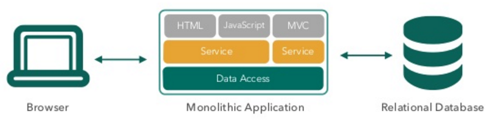
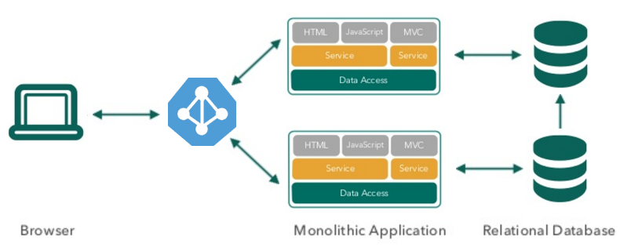
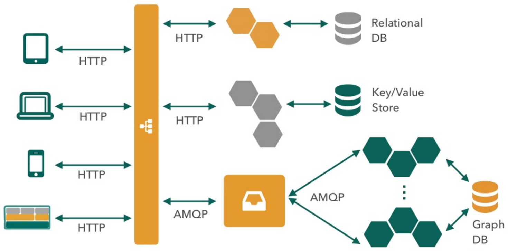

# Intro to containers and Docker

by *Adrian Moreno*

---

## Before

- Monolithic apps
- Build on a single stack such as Java or .NET
- Long lived
- Deployed to a single server

----

<!-- .slide: data-background="#fff" -->

### Monolithic app

----

<!-- .slide: data-background="#fff" -->

### Monolithic Load-balanced app

----

## Today

- Apps are constantly developed
- New versions are deployed frequently
- Built from loosely coupled components
- Deployed to multiple servers

----

<!-- .slide: data-background="#fff" -->

### Modern app

----

# How do you handle all these parts?

---

# Imagine you own a shipping company

----

<!-- .slide: data-background="images/piano.jpg" -->

----

<!-- .slide: data-background="images/piano-potatoes.png" -->

----

<!-- .slide: data-background="images/piano-potatoes-whiskey.png" -->

----

## How do we handle all these differences?

- Size of goods
- Form of goods
- Requirements to keep them safe
- Use different transport methods

----

<!-- .slide: data-background="images/intermodal-container.jpg" -->

----

# Now you can ship everything!

----

<!-- .slide: data-background="images/container-vessel.jpg" -->

----

<!-- .slide: data-background="images/truck-container.jpg" -->

----

<!-- .slide: data-background="images/cargo-train.jpg" -->

----

## Yes, but...
## what does it have to do with software?

----

Figure software in containers

---

# It worked in my computer

----

# The premise of Docker:

## Build once, run anywhere

----

# What is Docker?

----

## Virtualization tool?

Figure vmware, virtualbox

----

## VM manager?

Figure vagrant

----

## Configuration manager?

Figure Puppet, Chef, Ansible

----

## cgroups? LXC? libvirt?

---

## VMs vs Containers

Figure vms vs containers

----

# Containers

### Your applications run in containers

code: docker run ubuntu /bin/echo "Hello World"
Hello World

----

# Images

### Saved states of Containers

Code: docker images

----

# Dockerfile

### Series of commands to build an image

code: dockerfile example

----

# Docker Hub

### Public repository for Docker images

Figure screenshot

---

# Docker in numbers

- Launched in March 2013
- 21,000+ GitHub Stars
- 1B+ Docker Container Downloads
- 240,000+ Dockerized apps in Docker Hub
- 1600+ Community Contributors
- 50,000 Third party projects using Docker
- 200+ Meet Up groups

----

# Docker ecosystem

Figure ecosystem

----

---

# FIN
