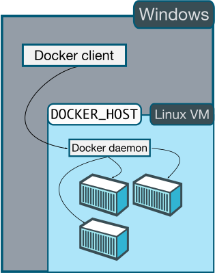

# Intro to containers and Docker

by *Adrian Moreno Martinez*

---

## A decade ago

- Monolithic apps
- Build on a single stack such as Java or .NET
- Long lived
- Deployed to a single server

----

<!-- .slide: data-background="#fff" -->

### <font color="#333">Monolithic app</font>


----

<!-- .slide: data-background="#fff" -->

### <font color="#333">Monolithic Load-balanced app</font>


----

## Today

- Apps are constantly developed
- New versions are deployed frequently
- Built from loosely coupled components
- Deployed to multiple servers

----

<!-- .slide: data-background="#fff" -->

### <font color="#333">Modern app</font>


----

# How do you handle all these parts?

---

# Imagine you own a shipping company

----

<!-- .slide: data-background="images/piano.jpg" data-background-size="80%" -->

----

<!-- .slide: data-background="images/piano-potatoes.png" data-background-size="80%" -->

----

<!-- .slide: data-background="images/piano-potatoes-whiskey.png" data-background-size="80%" -->

----

## How do we handle all these differences?

- Size of goods
- Form of goods
- Requirements to keep them safe
- Use different transport methods

----

<!-- .slide: data-background="images/intermodal-container.jpg" -->

----

# Now you can ship everything!

----

<!-- .slide: data-background="images/container-vessel.jpg" -->

----

<!-- .slide: data-background="images/truck-container.jpg" -->

----

<!-- .slide: data-background="images/cargo-train.jpg" -->

----

## Yes, but...
## what does it have to do with software?

----

## Your app is built out of many small parts
## ...called micro services

----

<!-- .slide: data-background="#fff" -->


----

<!-- .slide: data-background="#fff" -->


----

<!-- .slide: data-background="#fff" -->


----

<!-- .slide: data-background="#fff" -->


----

<!-- .slide: data-background="#fff" -->


----

## You can surely install it
## in a production server

----

## But... would it look the same in

## your dev environment?
## or in a lab? <!-- .element: class="fragment" data-fragment-index="1" -->
## or in the cloud somewhere? <!-- .element: class="fragment" data-fragment-index="2" -->

----

<!-- .slide: data-background="images/works-on-my-machine.jpg" data-background-size="60%" -->

---

<!-- .slide: data-background="images/docker.png" -->

----

## The premise of Docker:

# Build once,
# run anywhere

----

# What is Docker?

> <font color="#ccc">**Docker separates applications from infrastructure using container technology**</font>,
> similar to how virtual machines separate the OS from bare metal

----

## VMs vs Containers


----

# Docker benefits

- Rapid application deployment
- Portability across machines
- Version control and component reuse
- Sharing
- Lightweight footprint and minimal overhead


----

# Docker architecture


----

## Docker on Windows or OS X



----

# Containers

### Your applications run in containers

```
$ docker run ubuntu /bin/echo "Hello World"
Hello World
```

----

# Images

### Saved states of Containers

```
$ docker images
REPOSITORY       TAG      IMAGE ID      CREATED      VIRTUAL SIZE
training/webapp  latest   fc77f57ad303  3 weeks ago  280.5 MB
ubuntu           13.10    5e019ab7bf6d  4 weeks ago  180 MB
ubuntu           12.04    74fe38d11401  4 weeks ago  209.6 MB
ubuntu           12.10    a7cf8ae4e998  4 weeks ago  171.3 MB
ubuntu           14.04    99ec81b80c55  4 weeks ago  266 MB
```

----

# Dockerfile

### Series of commands to build an image

```
FROM ubuntu:12.04

RUN apt-get update
RUN apt-get install -y apache2

ENV APACHE_RUN_USER www-data
ENV APACHE_RUN_GROUP www-data
ENV APACHE_LOG_DIR /var/log/apache2

EXPOSE 80

CMD ["/usr/sbin/apache2", "-D", "FOREGROUND"]
```

----

# Docker Hub

### Public repository for Docker images


----

# Docker in numbers

- Launched in <font color="#fff">**March 2013**</font>
- <font color="#fff">**21,000+**</font> GitHub Stars
- <font color="#fff">**1B+**</font> Docker Container Downloads
- <font color="#fff">**240,000+**</font> Dockerized apps in Docker Hub
- <font color="#fff">**1600+**</font> Community Contributors
- <font color="#fff">**50,000**</font> Third party projects using Docker
- <font color="#fff">**200+**</font> Meet Up groups

----

# Google Trends

 <!-- .element: height="70%" -->

----

<!-- .slide: data-background="images/docker-ecosystem.jpg" data-background-size="80%" -->

---

<!-- .slide: data-background="images/demo-time.jpg" data-background-size="55%" -->

---

# FIN
