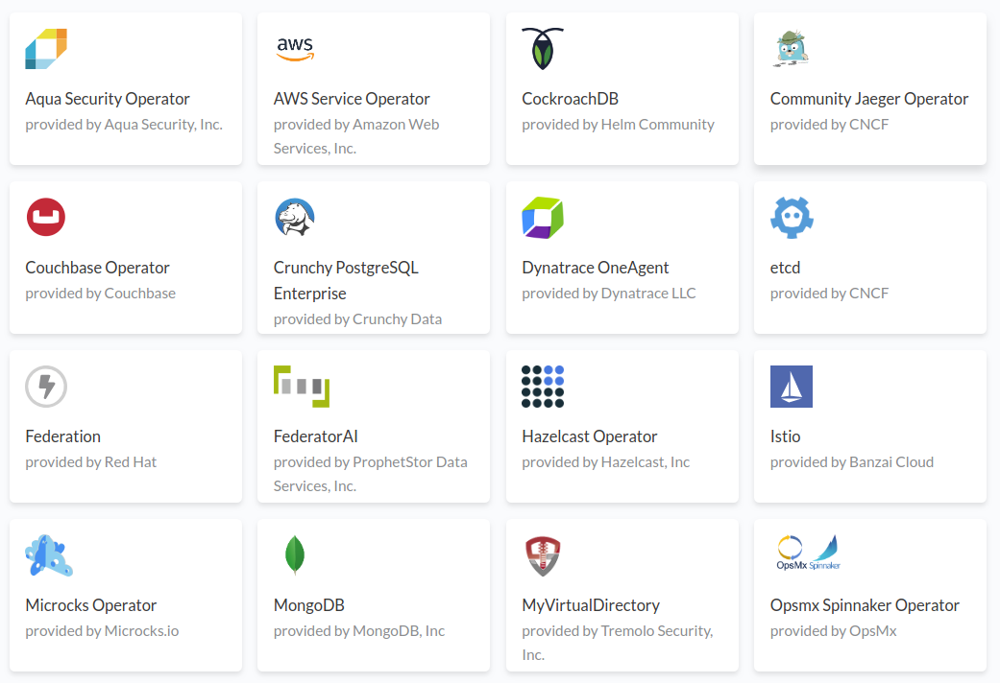

## Extending Kubernetes with operators

<br><br>

by [*Adrián Moreno Martínez*](https://github.com/adrianmo)</font>
<br>
*Tarragona Developers Meetup*
<br>
24/04/2019

---

## Operator

- ***Expert*** in a complex system
- ***Observes*** system status
- ***Reacts*** to system changes
- Performs complex, ***multi-step procedures***

 <!-- .element class="operator stretch" -->

---

<!-- .slide: data-background-image="img/kubernetes.png" data-background-size="100%" -->

---

<!-- .element: class="white-text" -->

<!-- .slide: data-background-color="#00950b" -->

## Resources

- A set of nouns (`Service`, `Pod`, `StatefulSet`, `Ingress`, ...)
- Abstract all the things that it takes to run an app
- Usually created with YAML/JSON

---

<!-- .element: class="white-text" -->

<!-- .slide: data-background-color="#0067a6" -->

## Event stream

- Append-only log made up of `Event`
- Contains everything that has happened in the Kubernetes cluster
  - User initiated: `create`, `update`, `delete`
  - Cluster events: node failures, errors, topology changes...

---

<!-- .element: class="white-text" -->

<!-- .slide: data-background-color="#d17100" -->

## Controllers

- `Pod`s that ***react*** to events
- Transform ***`current state`*** into ***`desired state`***

---

<!-- .slide: data-background-image="img/controllers.png" data-background-size="100%" -->

---

<!-- .slide: data-background-image="img/operators.png" data-background-size="100%" -->

---

## Why?

- The thing you want to ***control*** isn't an app
- I want to make something ***complex*** simpler to deploy
- I'm working with ***data*** and some operators must be ***tightly controlled***

---

## Why not?

- Requires more development effort
- Delegate cluster and resource permissions to the operator
- Tightly coupled to Kubernetes

---

## Operators out there



---

## Zookeeper operator

- Packaging of headless `Service`, load-balanced `Service`, `StatefulSet` into a single `ZookeeperCluster` resource
- Features:
  - Scale up/down
  - Handling for pod failure/recovery scenarios
  - Custom configuration

---

## Pravega operator

- Packaging of 1 `Deployment`, 2 `StatefulSet`, headless `Service`, load-balanced `Service`, etc.
- Features:
  - Scale up/down components
  - Upgrade cluster
  - Multiple Tier 2
  - External access
  - Custom configuration

---

## Custom Resource Definition

```
apiVersion: apiextensions.k8s.io/v1beta1
kind: CustomResourceDefinition
metadata:
  name: pravegaclusters.pravega.pravega.io
spec:
  group: pravega.pravega.io
  names:
    kind: PravegaCluster
    listKind: PravegaClusterList
    plural: pravegaclusters
    singular: pravegacluster
```

---

## Demo Custom Resource

```
apiVersion: "pravega.pravega.io/v1alpha1"
kind: "PravegaCluster"
metadata:
  name: "pravega"
spec:
  zookeeperUri: zk-client:2181

  bookkeeper:
    replicas: 3

  pravega:
    controllerReplicas: 1
    segmentStoreReplicas: 3
...
```

---

# Demo

---

## Practices

- Start with what your end-user **needs**
- **Package** the operator itself for installation
  - Helm is the most popular way
- Always consider how to **compare** against the current state
- Use an operator **framework** or SDK
  - CoreOS Operator SDK
  - Giant Swarm operatorkit

---

# Thank you

## Questions?

<br><br><br>

[adrianmo.github.io/slides/k8s-operators](http://adrianmo.github.io/slides/k8s-operators)
