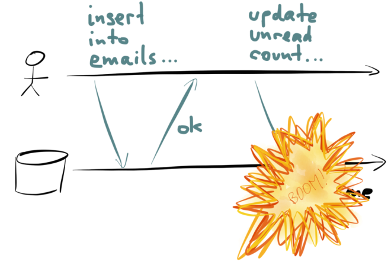

# Log-based
## architectures

  

by *Adrián Moreno Martínez*
 
@ *Tarragona Developers Meetup - 30/10/2018*

---

## About me

<table>
  <tr>
    <td width="30%" style="vertical-align: top;">
      
    </td>
    <td width="70%" style="vertical-align: top;">
- Adrián Moreno Martínez 
- Principal Software Engineer  @ Dell EMC 
- Background in distributed systems and DevOps
    </td>
  </tr>
</table>

---

<!-- .slide: data-transition="none" -->

----

<!-- .slide: data-transition="none" -->

----

<!-- .slide: data-transition="none" -->

----

<!-- .slide: data-transition="none" -->

---

---

---

----

<!-- .slide: data-transition="none" -->

----

<!-- .slide: data-transition="none" -->

----

<!-- .slide: data-transition="none" -->

----

<!-- .slide: data-transition="none" -->

----

---

---

----

Not this log

----

----

----

----

----

----

----

----

----

---

## Log data stores

- Apache Kafka
- Apache Pulsar
- Pravega
- DistributedLog
- ...

----

## Resources

- [Martin Kleppmann website](https://martin.kleppmann.com/)
- [Using logs to build a solid data infrastructure (or: why dual writes are a bad idea), Martin Kleppmann, 29 May 2015](https://www.confluent.io/blog/using-logs-to-build-a-solid-data-infrastructure-or-why-dual-writes-are-a-bad-idea/)
- [It’s Okay To Store Data In Apache Kafka, Jay Kreps, 15 Sep 2017](https://www.confluent.io/blog/okay-store-data-apache-kafka/)
- [Applying the Kappa architecture in the telco industry, Nicolas Seyvet and Ignacio Mulas Viela, 19 May 2016](https://www.oreilly.com/ideas/applying-the-kappa-architecture-in-the-telco-industry)
- [Publishing with Apache Kafka at The New York Times, Boerge Svingen,  6 Feb 2017](https://www.confluent.io/blog/publishing-apache-kafka-new-york-times/)
- [Turning the database inside out with Apache Samza, Martin Kleppmann, 11 Feb 2015](https://martin.kleppmann.com/2015/02/11/database-inside-out-at-salesforce.html)

----

## Resources

---

# Thank you

## Questions?

   

[adrianmo.github.io/slides/log-architectures](http://adrianmo.github.io/slides/log-architectures)

