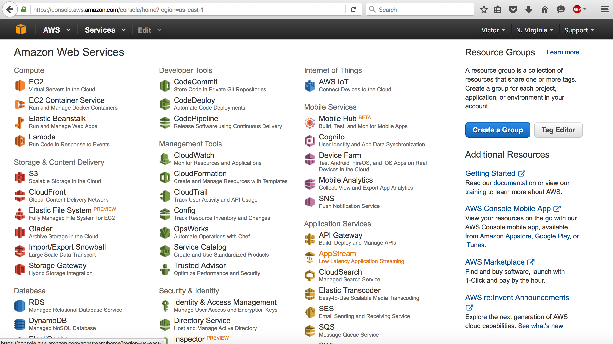
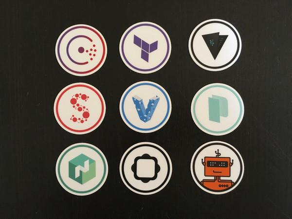

### Infrastructure as code
with
# Terraform

<br><br>

by <font color="#2196F3">*Adrián Moreno Martínez*</font>
<br>
@ *Tarragona Developers Meetup - 24/11/2016*

---

## Why Infrastructure as Code matters?

----

You can deploy infrastructure manually...



----


----

## Benefits
### of Infrastructure as Code

<br>

1. Repeatability
2. Automation<!-- .element: class="fragment" -->
3. Version Control<!-- .element: class="fragment" -->
4. Code Review<!-- .element: class="fragment" -->
5. Documentation<!-- .element: class="fragment" -->

---

## Hashicorp



----


> Terraform is kind of like Puppet for infrastructure
>
> -- <cite>Somebody</cite>

----

## Other solutions

<br>

* AWS CloudFormation
* OpenStack Heat
* Google Deployment manager
* Ansible
* SaltStack
* ...

----

## Terraform Facts

<br>

* Latest version: 0.7.10
* Open Source
* Written in Go
* Command-line client-side tool
* Precompiled binaries for Mac, Linux, Windows, FreeBSD, and OpenBSD
* Very active development
  * 14k+ Commits, 6k+ Stars, 2.1k+ Forks

----

## Terraform Features

<br>

* Creates resources declared in a source file
* Custom DSL (yet JSON-compatible)
* Detailed plan before execution
* Creates a dependency graph
* Supports multiple cloud providers and services

----

## Example
### Mail server infrastructure

<br>

* DNS MX Records with **CloudFlare**
* <!-- .element: class="fragment" -->Data analytics for spam with **AWS**
* <!-- .element: class="fragment" -->Mail storage on **OpenStack**, instances with attached block storage volumes
* <!-- .element: class="fragment" -->Monitoring and alerting service with **Datadog**


---

## State

<br>

* `terraform.tfstate`
* Atlas
* Object Storage (S3, Swift)
* KV store (Consul, etcd)
* HTTP

----

## Providers

<br>

* AWS
* OpenStack
* Azure
* DigitalOcean
* Docker
* VMware
* ...and many more

----

## Resources

<br>
* Each provider has a set of resources available
* e.g. AWS:
  * `aws_instance`, `aws_ebs_volume`, `aws_key_pair`, ...
  * https://www.terraform.io/docs/providers/aws/index.html

----

## Provisioners

<br>

* local-exec
* <!-- .element: class="fragment" -->remote-exec
* <!-- .element: class="fragment" -->file
* <!-- .element: class="fragment" -->Chef

----

## Provisioners

<br>

```
resource "aws_instance" "web" {
    ...

    provisioner "file" {
        source = "script.sh"
        destination = "/tmp/script.sh"
    }

    provisioner "remote-exec" {
        inline = [
          "chmod +x /tmp/script.sh",
          "/tmp/script.sh args"
        ]
    }

    ...
```

----

## Provisioners

<br>

```
    ...

    provisioner "local-exec" {
        command = "echo ${aws_instance.web.public_ip} > file.txt"
    }
}
```


----

## Modules
<br>

> Self-contained packages of Terraform configurations that are managed as a group

* Reuse code
* Support versioning
* https://github.com/terraform-community-modules

<br>

----

## Modules
<br>

Example:

```
module "consul" {
    source  = "github.com/hashicorp/consul/terraform/aws"
    servers = 5
    version = "0.4.0"
}
```

---

```plain
$ terraform --help
```

```plain
usage: terraform [--version] [--help] <command> [<args>]
```

```plain
Available commands are:
  * apply       Builds or changes infrastructure
  * destroy     Destroy Terraform-managed infrastructure
    fmt         Rewrites config files to canonical format
    get         Download and install modules for the configuration
    graph       Create a visual graph of Terraform resources
    init        Initializes Terraform configuration from a module
    output      Read an output from a state file
  * plan        Generate and show an execution plan
    push        Upload this Terraform module to Atlas to run
    refresh     Update local state file against real resources
    remote      Configure remote state storage
  * show        Inspect Terraform state or plan
    taint       Manually mark a resource for recreation
    untaint     Manually unmark a resource as tainted
    validate    Validates the Terraform files
    version     Prints the Terraform version
```

----

`example.tf`

```
resource "aws_instance" "instance_1" {
  ami             = "ami-0d77397e" # Ubuntu Server 16.04 LTS
  instance_type   = "t2.micro"
}

resource "aws_ebs_volume" "volume_1" {
    availability_zone  = "${aws_instance.instance_1.availability_zone}"
    type               = "gp2"
    size               = 8
}
...
```

----

`example.tf` (cont'd)

```
...
resource "aws_volume_attachment" "ebs_att" {
  device_name = "/dev/sdh"
  volume_id   = "${aws_ebs_volume.volume_1.id}"
  instance_id = "${aws_instance.instance_1.id}"
}

resource "aws_eip" "eip_1" {
  instance = "${aws_instance.instance_1.id}"
}
```

----

```plain
$ terraform plan
```

```plain
Refreshing Terraform state prior to plan...
...

+ aws_ebs_volume.volume_1
    availability_zone: "<computed>"
    iops:              "<computed>"
    size:              "8"
    snapshot_id:       "<computed>"
    type:              "gp2"

+ aws_eip.eip_1
...
+ aws_instance.instance_1
...
+ aws_volume_attachment.ebs_att
...
Plan: 4 to add, 0 to change, 0 to destroy.
```

----

```plain
$ terraform apply
```

```plain
aws_instance.instance_1: Creating...
  ami:                         "" => "ami-0d77397e"
  availability_zone:           "" => "<computed>"
  instance_type:               "" => "t2.micro"
  private_ip:                  "" => "<computed>"
  public_ip:                   "" => "<computed>"
  ...
aws_instance.instance_1: Still creating... (10s elapsed)
aws_instance.instance_1: Creation complete
aws_eip.eip_1: Creating...
  allocation_id:     "" => "<computed>"
  public_ip:         "" => "<computed>"
  ...
aws_ebs_volume.volume_1: Creating...
...
```
```plain
Apply complete! Resources: 4 added, 0 changed, 0 destroyed.

The state of your infrastructure has been saved to the path
below. This state is required to modify and destroy your
infrastructure, so keep it safe. To inspect the complete state
use the `terraform show` command.

State path: terraform.tfstate
```

----

```plain
$ terraform show
```

```plain
aws_ebs_volume.volume_1:
  id = vol-31817981
  availability_zone = eu-west-1c
  encrypted = false
  size = 8
  snapshot_id =
  type = gp2
```
```plain
aws_eip.eip_1:
  id = eipalloc-46e8c822
  association_id = eipassoc-60c7b819
  domain = vpc
  instance = i-ee37df78
  network_interface = eni-8842bcd9
  private_ip = 172.31.35.110
  public_ip = 52.212.62.23
  vpc = true
```
```plain
aws_instance.instance_1:
  id = i-ee37df78
  ami = ami-0d77397e
  associate_public_ip_address = true
  availability_zone = eu-west-1c
  ...
```

----

```plain
$ terraform destroy
```

```plain
Do you really want to destroy?
  Terraform will delete all your managed infrastructure.
  There is no undo. Only 'yes' will be accepted to confirm.

  Enter a value: yes
```
```plain
aws_instance.instance_1: Refreshing state... (ID: i-ee37df78)
aws_ebs_volume.volume_1: Refreshing state... (ID: vol-31817981)
aws_eip.eip_1: Refreshing state... (ID: eipalloc-46e8c822)
aws_volume_attachment.ebs_att: Refreshing state... (ID: vai-2568551765)
aws_volume_attachment.ebs_att: Destroying...
aws_eip.eip_1: Destroying...
aws_eip.eip_1: Destruction complete
aws_volume_attachment.ebs_att: Destruction complete
aws_ebs_volume.volume_1: Destroying...
aws_ebs_volume.volume_1: Destruction complete
aws_instance.instance_1: Destroying...
aws_instance.instance_1: Still destroying... (10s elapsed)
aws_instance.instance_1: Still destroying... (20s elapsed)
aws_instance.instance_1: Destruction complete

Destroy complete! Resources: 4 destroyed.
```

---

# Live Demo

---

## Terraform in CI/CD

* Using [gitflow](http://danielkummer.github.io/git-flow-cheatsheet/) (feature branches)
* Lock master branch
* New push into feature branch
  * `terraform plan`
* Feature merged into master branch
  * `terraform plan` + `apply`

---

# Thank you

## Questions?

<br><br><br>

<font size="22">
[adrianmo.github.io/slides/terraform-tgndevs](http://adrianmo.github.io/slides/terraform-tgndevs)
</font>
