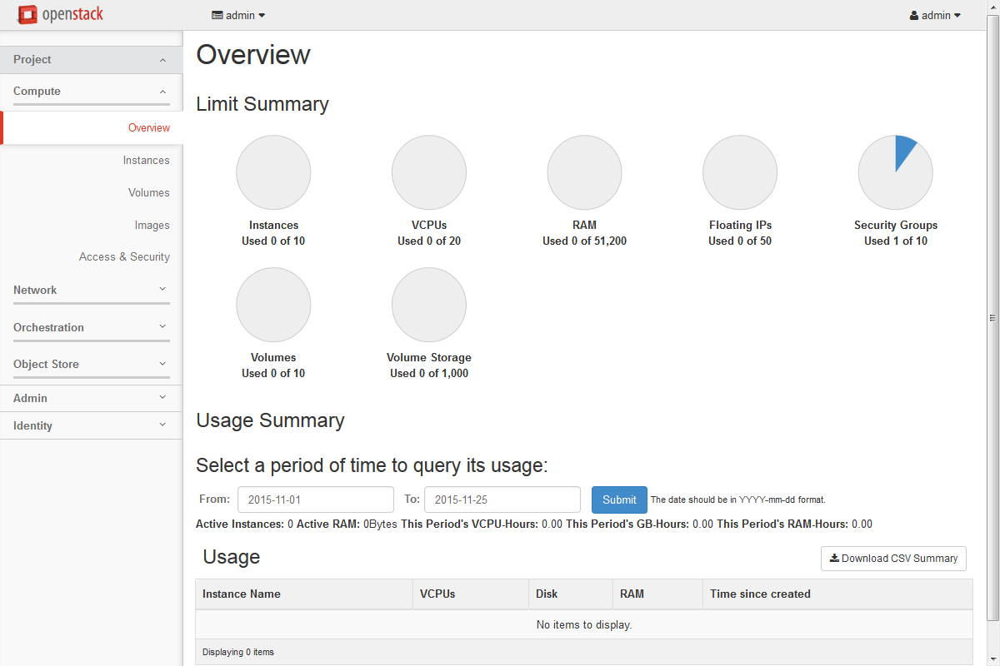

### Infrastructure as code
with
# Terraform

<br><br>

by *Adrian Moreno Martinez*

---

## Why Infrastructure as Code matters?


----

You can deploy infrastructure manually...



----


----

## Benefits
### of Infrastructure as Code

<br>

1. Repeatability
2. Automation
3. Version Control
4. Code Review
5. Documentation

---

## Hashicorp


----


> Terraform is kind of like Puppet for infrastructure
>
> -- <cite>Somebody</cite>

----

## Other solutions

<br>

* CloudFormation
* OpenStack Heat
* Google Deployment manager
* Ansible
* SaltStack
* ...

----

## Terraform Facts

<br>

* Latest version: 0.6.16
* Open Source
* Written in Go
* Command-line client-side tool
* Precompiled binaries for Mac, Linux, Windows, FreeBSD, and OpenBSD
* Very active development
  * 11k+ Commits, 5k+ Stars, 1.5k+ Forks

----

## Terraform Features

<br>

* Creates resources declared in a source file
* Custom DSL (yet JSON-compatible)
* Detailed plan before execution
* Creates a dependency graph
* Supports multiple cloud providers and services

----

## Example
### Mail server infrastructure

<br>

* DNS MX Records with CloudFlare
* Data analytics for spam with AWS
* Mail storage on OpenStack, instances with attached block storage volumes

---

## State

<br>

* `terraform.tfstate`
* Atlas
* Object Storage (S3, Swift)
* KV store (Consul, etcd)
* HTTP

----

## Providers

<br>

* AWS
* OpenStack
* Azure
* DigitalOcean
* Docker
* VMware
* ...and many more

----

## Provisioners

<br>

* local-exec
* remote-exec
* file
* Chef

----

## Provisioners

<br>

```
# Run puppet and join our Consul cluster
resource "aws_instance" "web" {
    ...
    provisioner "remote-exec" {
        inline = [
        "puppet apply",
        "consul join ${aws_instance.web.private_ip}"
        ]
    }

    provisioner "local-exec" {
        command = "echo ${aws_instance.web.public_ip} > file.txt"
    }
}
```

----

## Modules
<br>

> Self-contained packages of Terraform configurations that are managed as a group

* Reuse code
* Support versioning
* https://github.com/terraform-community-modules

<br>

Example:

```
module "consul" {
    source = "github.com/hashicorp/consul/terraform/aws"
    servers = 3
}
```

---

```plain
$ terraform
```

```plain
usage: terraform [--version] [--help] <command> [<args>]
```

```plain
Available commands are:
  * apply       Builds or changes infrastructure
  * destroy     Destroy Terraform-managed infrastructure
    fmt         Rewrites config files to canonical format
    get         Download and install modules for the configuration
    graph       Create a visual graph of Terraform resources
    init        Initializes Terraform configuration from a module
    output      Read an output from a state file
  * plan        Generate and show an execution plan
    push        Upload this Terraform module to Atlas to run
    refresh     Update local state file against real resources
    remote      Configure remote state storage
  * show        Inspect Terraform state or plan
    taint       Manually mark a resource for recreation
    untaint     Manually unmark a resource as tainted
    validate    Validates the Terraform files
    version     Prints the Terraform version
```

----

`example.tf`

```
resource "openstack_compute_floatingip_v2" "floatip_1" {
  pool = "public"
}

resource "openstack_blockstorage_volume_v1" "volume_1" {
  region = "RegionOne"
  name = "tf-test-volume"
  description = "first test volume"
  size = 8
}

...
```

----

`example.tf` (cont'd)

```
...

resource "openstack_networking_network_v2" "network_1" {
  name = "network_1"
  admin_state_up = "true"
}

resource "openstack_networking_subnet_v2" "subnet_1" {
  name = "subnet_1"
  network_id = "${openstack_networking_network_v2.network_1.id}"
  cidr = "192.168.199.0/24"
  ip_version = 4
}

...
```

----

`example.tf` (cont'd 2)

```
...
resource "openstack_compute_instance_v2" "instance_1" {
  name = "tf-instance-1"
  image_name = "CentOS-7-x86_64-GenericCloud-1606"
  flavor_name = "v4.medium"
  key_pair = "cat_kp"
  security_groups = ["default"]

  volume {
    volume_id = "${openstack_blockstorage_volume_v1.volume_1.id}"
  }

  network {
    uuid = "${openstack_networking_network_v2.network_1.id}"
    floating_ip = "${openstack_compute_floatingip_v2.floatip_1.address}"
  }
}
```

----

```plain
$ terraform plan
```

```plain
Refreshing Terraform state prior to plan...
...

+ openstack_compute_floatingip_v2.floatip_1
    address:     "" => "<computed>"
    fixed_ip:    "" => "<computed>"
    instance_id: "" => "<computed>"
    pool:        "" => "public"
...
+ openstack_blockstorage_volume_v1.volume_1
...
+ openstack_networking_network_v2.network_1
...
+ openstack_networking_subnet_v2.subnet_1
...

Plan: 5 to add, 0 to change, 0 to destroy.
```

----

```plain
$ terraform apply
```

```plain
openstack_compute_floatingip_v2.floatip_1: Creating...
  address:     "" => "<computed>"
  fixed_ip:    "" => "<computed>"
  instance_id: "" => "<computed>"
  pool:        "" => "public"
openstack_networking_network_v2.network_1: Creating...
  ...
openstack_compute_floatingip_v2.floatip_1: Creation complete
openstack_networking_network_v2.network_1: Still creating... (10s elapsed)
openstack_networking_network_v2.network_1: Creation complete
...
```
```plain
Apply complete! Resources: 5 added, 0 changed, 0 destroyed.

The state of your infrastructure has been saved to the path
below. This state is required to modify and destroy your
infrastructure, so keep it safe. To inspect the complete state
use the `terraform show` command.

State path: terraform.tfstate
```

----

```plain
$ terraform destroy
```

```plain
Do you really want to destroy?
  Terraform will delete all your managed infrastructure.
  There is no undo. Only 'yes' will be accepted to confirm.

  Enter a value: yes

openstack_networking_network_v2.network_1: Refreshing state... (ID: 6f837786-841f-421e-aac7-8bd465b004ef)
openstack_compute_floatingip_v2.floatip_1: Refreshing state... (ID: b650a867-4a1f-4f7b-9318-ffd9b0e92238)
openstack_networking_subnet_v2.subnet_1: Refreshing state... (ID: 27d547ae-fe81-4030-a075-d5cfa1e80e10)
openstack_networking_subnet_v2.subnet_1: Destroying...
openstack_compute_floatingip_v2.floatip_1: Destroying...
openstack_compute_floatingip_v2.floatip_2: Destroying...
openstack_compute_floatingip_v2.floatip_2: Destruction complete
openstack_compute_floatingip_v2.floatip_1: Destruction complete
...

Apply complete! Resources: 0 added, 0 changed, 5 destroyed.
```

---

## Available OpenStack resources

----

### Compute / Nova

* Instance
* Floating IP
* Key Pair
* Security Group
* Server Group

----

### Block Storage / Cinder

* Volumes

----

### Network / Neutron

* Network
* Subnet
* Router and Router Interface
* Floating IP
* Port

----

### LBaaS / Neutron

* Monitor
* Pool
* Virtual IP

----

### FWaaS / Neutron

* Firewall
* Policy
* Rule

----

### Object Storage / Swift

* Container

---

# Live Demo

---

## Terraform in CI/CD

* Using [gitflow](http://danielkummer.github.io/git-flow-cheatsheet/) (feature branches)
* Lock master branch
* New push into feature branch
  * `terraform production init` + `plan`
* Feature merged into master branch
  * `terraform production init` + `plan` + `apply`

---

# Thank you

## Questions?

<br><br><br>

[adrianmo.github.io/slides/terraform](http://adrianmo.github.io/slides/terraform)
