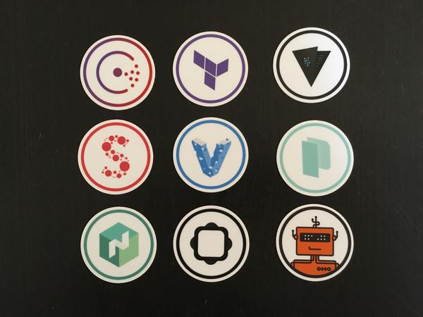

## Infrastructure as code with
# Terraform

by *Adrian Moreno Martinez*

---

## Hashicorp



----

## Vagrant

> Mimic development environment

* VirtualBox
* VMware
* Docker
* AWS
* Google Cloud
* ...

----

## Terraform

> Mimic infrastructure

* AWS
* OpenStack
* Digital Ocean
* Google Cloud
* Azure
* ...

----

## Other solutions

* CloudFormation
* OpenStack Heat
* Google Deployment manager
* Puppet
* Ansible
* SaltStack
* ...

----

## Terraform Facts

* Latest version: x.x
* Open Source
* Written in Go
* Command-line client-side tool
* Precompiled binaries for Mac, Linux, Windows, FreeBSD, and OpenBSD
* Very active development

----

## Terraform Features

* Kind of like Puppet for infrastructure (infra level rather than system)
* Creates resources declared in a source file
* Supports multiple cloud providers and services
* An infrastructure declaration can use multiple providers and services
* Custom DSL (yet JSON-compatible)

----

## Mail server infrastructure

* DNS MX Records with CloudFlare
* Data analytics for spam with AWS
* Mail storage on OpenStack, instances with attached block storage volumes

----

`example.tg`

```
resource "openstack_compute_floatingip_v2" "floatip_1" {
  pool = "public"
}

resource "openstack_blockstorage_volume_v1" "volume_1" {
  region = "RegionOne"
  name = "tf-test-volume"
  description = "first test volume"
  size = 3
}
```

---

## Available OpenStack resources

----

### Compute / Nova

* Instance
* Floating IP
* Key Pair
* Security Group
* Server Group

----

### Block Storage / Cinder

* Volumes

----

### Network / Neutron

* Network
* Subnet
* Router and Router Interface
* Floating IP
* Port

----

### LBaaS / Neutron

* Monitor
* Pool
* Virtual IP

----

### FWaaS / Neutron

* Firewall
* Policy
* Rule

----

### Object Storage / Swift

* Container

---

## State

* `terraform.tfstate`
* Atlas
* Object Storage (S3, Swift)
* KV store (Consul, etcd)
* HTTP

----

```
terraform remote config \
    -backend=swift \
    -backend-config="path=random/path"
```

----

## Modules

> Self-contained packages of Terraform configurations that are managed as a group

* Support versioning
* https://github.com/terraform-community-modules
* Example:

```
module "consul" {
    source = "github.com/hashicorp/consul/terraform/aws"
    servers = 3
}
```

----

```plain
$ terraform
```

```plain
usage: terraform [--version] [--help] <command> [<args>]
```

```plain
Available commands are:
    apply       Builds or changes infrastructure
    destroy     Destroy Terraform-managed infrastructure
    fmt         Rewrites config files to canonical format
    get         Download and install modules for the configuration
    graph       Create a visual graph of Terraform resources
    init        Initializes Terraform configuration from a module
    output      Read an output from a state file
    plan        Generate and show an execution plan
    push        Upload this Terraform module to Atlas to run
    refresh     Update local state file against real resources
    remote      Configure remote state storage
    show        Inspect Terraform state or plan
    taint       Manually mark a resource for recreation
    untaint     Manually unmark a resource as tainted
    validate    Validates the Terraform files
    version     Prints the Terraform version
```

---

# Demo

---

## Terraform in CI/CD

* Using [gitflow](http://danielkummer.github.io/git-flow-cheatsheet/) (feature branches)
* Lock master branch
* New push into feature branch
  * `terraform production init` + `plan`
* Feature merged into master branch
  * `terraform production init` + `plan` + `apply`

---

# Thank you

## Questions?

<br><br><br>

[adrianmo.github.io/slides/terraform](http://adrianmo.github.io/slides/terraform)
