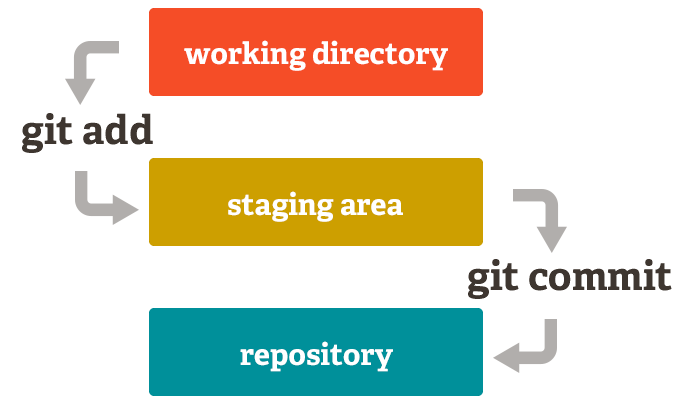

# Why should I be using Git?

by *Adrian Moreno Martinez*

---


> Git is an **open source**, **distributed** version control system designed for speed and efficiency

----

## Git facts

- Started in 2005
- Created by *Linus Torvald* to help in Linux kernel development
- Available in most OS
- It is a de facto standard

----

## Git key features

- Distributed nature
- Everything is local (full history tree available offline)
- Branching and merging model
- No access control
- Fast
- Light

----

## Other version control systems

- Subversion (SVN)
- CVS
- Perforce
- Mercurial
- Bazaar
- ...

----

## Centralized workflow


----

## Distributed workflow


---

Everything starts with a

<code class="single">git clone</code>

or

<code class="single">git init</code>

----

```bash
$ git clone https://github.com/tgndevs/slack-autoinvite.git

Cloning into 'slack-autoinvite'...
remote: Counting objects: 203, done.
remote: Total 203 (delta 0), reused 0 (delta 0), pack-reused 203
Receiving objects: 100% (203/203), 139.14 KiB | 0 bytes/s, done.
Resolving deltas: 100% (82/82), done.
Checking connectivity... done.
```

----

```bash
$ git init
# Initialize the local directory as a Git repository

$ git remote add origin https://github.com/user/repo.git
# Set a new remote

git remote -v
# Verify new remote
origin  https://github.com/user/repo.git (fetch)
origin  https://github.com/user/repo.git (push)
```

----



----

## Pushing changes

<code class="single">git push origin master</code>

---

# Git Workflow

----

## Master branch


----

## New Feature branch


----

## Fast-forward Merge


----

## 3-Way Merge


----


----

## Pull-request

a.k.a. Merge-request


---

# Git Hosting

----


- Reference git hosting for open source projects
- Free for open source repos
- Paid for private repos
- Unlimited number of collaborators
- GitHub Enterprise On-premises

----


- Unlimited private repos
- Free for small teams (up to 5 users)
- Unintuitive UI

----


- Now known as BitBucket Server
- On-premises
- Integration with Atlassian tools (Jira, HipChat, Bamboo, ...)
- $10 up to 10 users, $1.800 up to 25 users, ...

----


- On-premises and hosted
- Unlimited repos and collaborators on hosted offering
- Free Community Edition
- Comes with GitLab CI for continuous integration and delivery

---

# Useful Tools

----

## SourceTree


----


---

# FIN

http://adrianmo.github.io/slides/whygit
